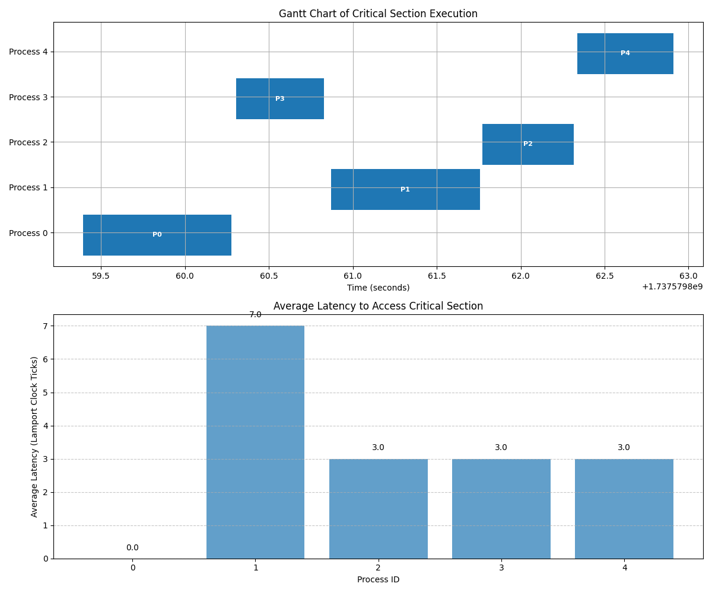

# Lamport Mutual Exclusion with `multiprocessing` and Sockets

## Overview

This project demonstrates **Lamport’s Mutual Exclusion** algorithm in a simulated **distributed environment**, using **Python’s `multiprocessing`** to create multiple processes (representing nodes) and **TCP sockets** for communication. The simulation ensures FIFO order, mutual exclusion, and logical clock synchronization between processes.

## Simulating a Distributed Environment

In order to simulate a distributed environment, each node in the system is represented by a separate process. These processes communicate with each other using TCP sockets, allowing them to exchange messages and coordinate access to a shared resource (the critical section).

### Sockets and TCP

Each node in the simulation is assigned a unique ID and a corresponding TCP server running on `localhost` at `port = 5000 + node_id`. The communication between nodes is achieved by:

1. **Connection Management**: A `ConnectionPool` handles persistent TCP connections between nodes, ensuring that each node can send messages to any other node efficiently.
2. **Line-Delineated Messages**: Messages are sent as strings, each terminated with `"\n"`. This ensures the receiver can correctly split and process complete messages, even when multiple messages arrive in a single transmission.
3. **Server-Client Interaction**: Each node starts a TCP server to listen for incoming messages from other nodes. A separate thread handles each incoming connection, ensuring asynchronous communication.

---

## File Structure

### 1. **`main.py`**

The main entry point of the simulation, orchestrating the execution of all processes (nodes) in the distributed system. It:

- **Initialization**: Spawns `N` independent processes, each simulating a node in the distributed system.
- **Node Workflow**: Each process initializes a `LamportNode`, starts its server to listen for messages, participates in requesting and accessing the critical section, and gracefully shuts down after completing its tasks.
- **Result Aggregation**: Collects and aggregates simulation data (e.g., critical section history, message counts, shared counter) for final reporting. Outputs a summary of the simulation, including execution metrics, and saves results in a JSON file.

---

### 2. **`connection_pool.py`**

Manages communication between nodes, simulating a distributed network using TCP sockets. The `ConnectionPool` class:

- **Establishes Connections**: Opens TCP connections to other nodes (using the target node's port).
- **Handles Messaging**: Sends and receives messages between nodes, ensuring reliable communication over a simulated network.
- **Closes Connections**: Properly terminates all connections during a graceful shutdown to avoid resource leaks or connection errors.

The `ConnectionPool` ensures nodes can communicate seamlessly while maintaining logical isolation.

---

### 3. **`lamport_node.py`**

Implements the **Lamport Mutual Exclusion algorithm**, enabling nodes to coordinate their access to a shared resource (critical section) in a distributed environment. Each node autonomously handles synchronization, communication, and task execution. 

#### Logical Workflow for Each Node:
1. **Requesting Access**:
   - The node increments its Lamport clock and sends a `REQUEST` message to all other nodes.
   - It adds its request (a tuple containing its clock value and ID) to a priority queue.
   - The node waits until it receives `REPLY` messages from all other nodes.

2. **Entering the Critical Section**:
   - When the node's request is at the head of its priority queue, it enters the critical section.
   - Inside the critical section, the node increments the shared counter (a simulated shared resource) and logs the event.

3. **Releasing Access**:
   - After completing the critical section, the node sends a `RELEASE` message to all other nodes.
   - The node removes its own request from the priority queue, allowing the next node in line (based on the queue's order) to proceed.

4. **Message Processing**:
   - Nodes continuously listen for and handle incoming messages:
     - **`REQUEST`**: Adds the request to the priority queue and replies to the sender.
     - **`REPLY`**: Acknowledges the sender's readiness to wait.
     - **`RELEASE`**: Removes the sender's request from the queue, updating its state.
     - **`SHUTDOWN`**: Tracks the termination state of other nodes, allowing a coordinated shutdown.

5. **Graceful Shutdown**:
   - Once all tasks are complete, the node broadcasts a `SHUTDOWN` message to inform other nodes that it has finished.
   - The node remains active until it receives `SHUTDOWN` messages from all other nodes, ensuring a synchronized and error-free termination of the simulation. This prevents premature closure of TCP connections.

### Managing the Request Queue in Lamport's Nodes

The `request_queue` is central to maintaining FIFO order and ensuring consistency across nodes. Each node independently manages its queue by:

#### **1. Adding Requests (`REQUEST`)**

When a node receives a `REQUEST` message, it adds the `(lamport_clock, sender_id)` tuple to its priority queue:

```python
if msg_type == "REQUEST":
    self.request_queue.put((msg_clock, msg_sender))
    self.log(f"Added request from Node {msg_sender} with clock {msg_clock} to the queue.")
    # Automatically send a REPLY back to the sender
    self.increment_clock()
    reply_message = f"REPLY {self.lamport_clock} {self.my_id}\n"
    self.connection_pool.send_message(msg_sender, reply_message)
```

#### **2. Processing Releases (`RELEASE`)**

Upon receiving a `RELEASE` message, the node removes the corresponding request from its queue, allowing the next request to proceed:

```python
if msg_type == "RELEASE":
    if not self.request_queue.empty():
        top_item = self.request_queue.get()
        if top_item[1] != msg_sender:
            self.log(f"ERROR: Top item {top_item} does not match Node {msg_sender}'s release.")
            self.request_queue.put(top_item)
        else:
            self.log(f"Removed request from Node {msg_sender} with clock {msg_clock}.")
```

### **3. Consistency Across Nodes**

All nodes maintain their own `request_queue` and process requests based on their logical clock. Since the queue uses a priority mechanism (`(clock, id)`), the order is consistent across all nodes, ensuring FIFO behavior.

---

## Simulation Workflow

1. **Initialization**:
   - `main.py` creates `N` processes, each running a `LamportNode`.

2. **Server Start**:
   - Each node starts a TCP server to listen for messages.

3. **Requesting the Critical Section**:
   - A node broadcasts a `REQUEST` message, adds its request to the queue, and waits for `REPLY` messages.

4. **Entering and Releasing the Critical Section**:
   - Once the node's request is at the head of the queue, it enters the critical section.
   - After finishing, it sends a `RELEASE` message to allow other nodes to proceed.

5. **Shutdown**:
   - Each node broadcasts a `SHUTDOWN` message after completing its tasks.
   - Nodes stop when they have received `SHUTDOWN` messages from all other nodes.
  
### Simulation Results
(more detailed results discussion is available here: 

https://github.com/cleb98/lamport_distributed_mutex/blob/main/multiprocess/Lamport%20mutual%20exclusion.pdf 

in "Lamport mutual exclusion.pdf")

```
--- Final Results ---
cs_history: [(0, 15), (3, 18), (1, 25), (2, 28), (4, 31)]
shared_counter: 5
message_count: {0: 12, 1: 12, 2: 12, 3: 12, 4: 12}
Total messages sent: 60
Execution time: 5.9807s
```



---

## Key Advantages

- **FIFO Order**: Ensured by the priority queue at each node.
- **Distributed Coordination**: The use of TCP sockets and `ConnectionPool` mimics real-world distributed systems.
- **Logical Clock Synchronization**: Lamport clocks ensure a consistent order of events.
- **Graceful Shutdown**: The `SHUTDOWN` message prevents premature termination, ensuring all nodes finish their tasks.

## Disadvantages

1. **Increased Overhead Due to TCP Sockets**  
   The use of TCP sockets for simulating a distributed environment adds significant overhead. Each node must maintain multiple persistent connections, which can lead to resource exhaustion and increased latency, especially in systems with a large number of nodes.

2. **Queue Management Complexity**  
   Each node independently manages its request queue. While the use of Lamport clocks ensures FIFO order, discrepancies in processing speeds between nodes may cause temporary inconsistencies or delays. 
   <!-- 
   For example, when handling `REQUEST`, `REPLY`, and `RELEASE` messages, each node must ensure proper synchronization of its queue:  
   ```python
   if not self.request_queue.empty():
       top_item = self.request_queue.get()
       if top_item[1] != msg_sender:
           self.log(f"ERROR: top item {top_item} != {msg_sender} releasing.")
           self.request_queue.put(top_item) 
    -->

3. **Lack of Fault Tolerance**  
   The system does not handle node failures. If a node crashes or fails to respond, the entire system may deadlock or experience indefinite blocking as other nodes wait for replies. There is no mechanism for detecting or recovering from failed nodes.

4. **No Scalability for Large Systems**  
   As the number of nodes increases, the number of TCP connections grows quadratically, along with the overhead of message processing. This makes the current implementation unsuitable for large-scale distributed systems.

5. **Artificial Synchronization in Shutdown**  
   The `SHUTDOWN` message, while necessary to ensure graceful termination of the simulation, is not part of Lamport’s original algorithm. This addition diverges from the pure Lamport mutual exclusion model and introduces extra complexity to coordinate node termination.

   ------

## Key Classes and Their Roles

### **1. `ConnectionPool` (from `connection_pool.py`)**

Manages TCP connections for a node. 

#### Attributes:
- `my_id`: The ID of the current node.
- `total_nodes`: Total number of nodes in the system.
- `connections`: A dictionary storing TCP sockets for each connected node.
- `lock`: Ensures thread-safe connection handling.

#### Key Methods:
- **`get_connection(to_id)`**: Establishes and returns a TCP connection to the node with ID `to_id`.
- **`send_message(to_id, message)`**: Sends a message to the specified node using the connection.
- **`close_all()`**: Closes all open connections.

---

### **2. `LamportNode` (from `lamport_node.py`)**

Implements the logic of Lamport's Mutual Exclusion algorithm for each node.

#### Attributes:
- `my_id`: The ID of the current node.
- `total_nodes`: Total number of nodes.
- `port`: The TCP port the node's server listens on.
- `lamport_clock`: Logical clock for the node.
- `request_queue`: A priority queue storing tuples `(lamport_clock, process_id)` for maintaining FIFO order.
- `replies_received`: Count of replies received for the current critical section request.
- `in_critical_section`: Flag indicating whether the node is in the critical section.
- `connection_pool`: Instance of `ConnectionPool` for managing connections.
- `shutdown_set`: Tracks nodes that have sent `SHUTDOWN` messages.

#### Key Methods:

1. **Critical Section Management**
   - **`request_cs()`**:
     - Adds the node's request to the priority queue.
     - Sends a `REQUEST` message to all other nodes.
     - Waits for `REPLY` messages from all other nodes.
     - Enters the critical section only if the node's request is at the head of the queue.
   - **`release_cs()`**:
     - Removes the node's request from the queue.
     - Sends a `RELEASE` message to all other nodes, allowing them to process the next request in the queue.

2. **Message Handling**
   - **`broadcast_message(message)`**:
     - Sends a message to all other nodes using the `ConnectionPool`.
   - **`handle_message(line)`**:
     - Processes incoming messages:
       - `REQUEST`: Add the request to the queue and send a `REPLY` to the sender.
       - `REPLY`: Increment the count of replies received.
       - `RELEASE`: Remove the sender's request from the queue.
       - `SHUTDOWN`: Mark the sender as done; if all nodes have sent `SHUTDOWN`, stop the node.

3. **Server and Client**
   - **`run_server()`**:
     - Starts a TCP server to listen for messages.
   - **`handle_client(conn)`**:
     - Reads and processes messages from a connected client socket.

4. **Clock Synchronization**
   - **`increment_clock()`**: Increments the node's Lamport clock.
   - **`update_clock(other_clock)`**: Updates the Lamport clock based on the maximum of the current and received clock values.

5. **Shutdown Coordination**
   - **`broadcast_shutdown()`**:
     - Sends a `SHUTDOWN` message to all nodes.
   - **`stop()`**:
     - Stops the server and closes all connections.

---
